# Encoded Signal

## Description

> We intercepted a strange signal. Analyze the attached .wav file, decode the transmission and recover the flag.

[chall.wav](chall.wav)

## Solution

Slow scan television (SSTV) is a narrowband communication mode for transmitting static images over voice channels. By drastically reducing the scan rate the ~3 MHz bandwidth of standard television is compressed into ~3 kHz enabling image transfer via SSB transceivers on amateur radio bands.

### Spectrogram Analysis

A great way to start off audio forensics challenges is by looking at the [spectrogram](https://www.audacityteam.org/download/) as shown below:

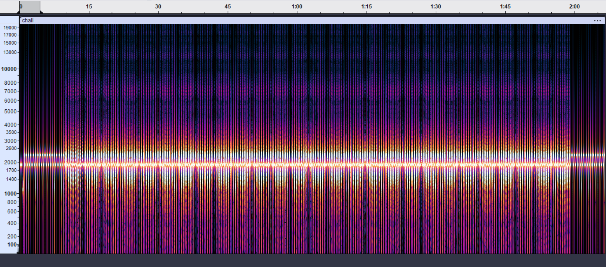

Upon zooming in we notice that the starting second of the audio is different than the remaining part. The "leader tone" is as follows:

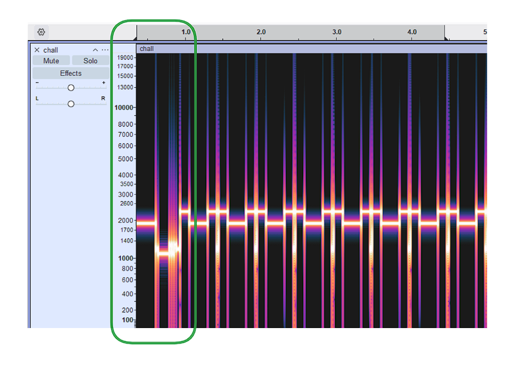

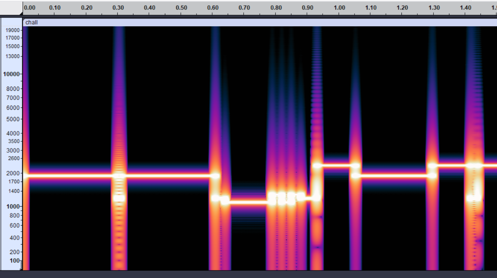

- a line at 1900 Hz (300 ms): It tells listening software with an Auto Start feature to wake up and start recording. It also gives the software a moment to adjust to the volume/amplitude of the incoming signal.
- equally bright at 1200 Hz: intermediate between 1st and 3rd signals.
- another line at 1900 Hz (300 ms): Continuation of the wake up and volume calibration phase ensuring the receiver is fully locked on before the digital data starts.
- a short line at 1200 Hz (30 ms): Marks the end of wake up phase and start of digital ID code.
- rapid jumps up and down (30 ms each - VIS Data Code): It shifts strictly between 1100 Hz and 1300 Hz. 1100 Hz = binary 1 and 1300 Hz = binary 0. For PD 120 (the type of sstv used) that number is 95. The decoder automatically switches its decoding canvas to the exact resolution and color settings needed for a PD 120 image.    
- final stop bit at 1200 Hz (30 ms): Marks the end of ID and start of image.

Now the interpreter builds the image using frequencies between 1500 Hz (Black) and 2300 Hz (White). This particular signal uses **PD-120** which is an SSTV mode by Paul Turner (G4IJE) and Don Rotier (K0HEO) that transmits 640x480 images in about two minutes using YCrCb 4:2:0 color encoding at 190 μs/pixel.

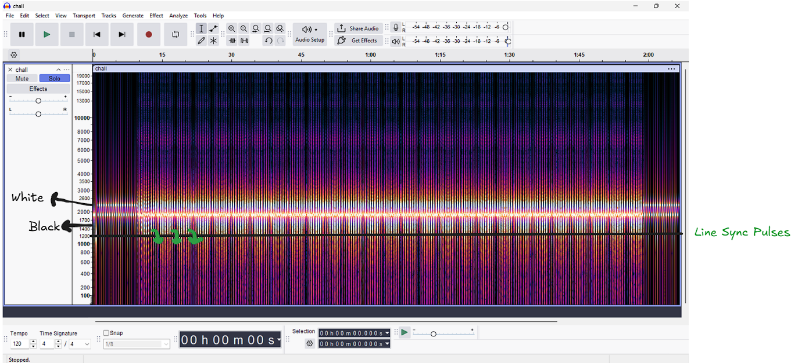 

Each line sync pulse lasting 20 ms acts like a carriage return in the image. The interpreter reads the image row by row and these pulses go lower than even the darkest black at 1200 Hz to signal a line change.

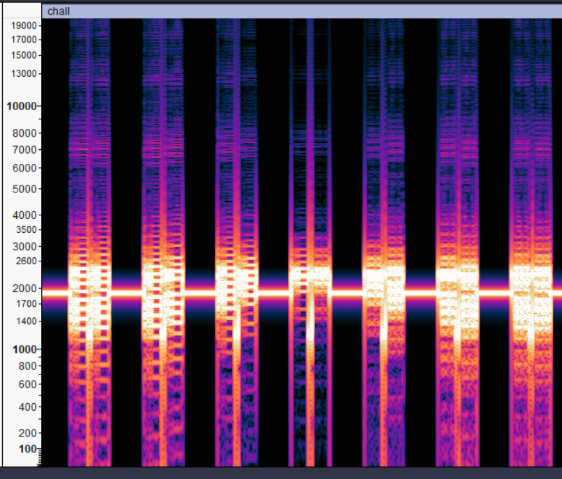

### SSTV Decoding with MMSSTV

For a deeper understanding of SSTV decoding, refer to the [SSTV Handbook](https://www.sstv-handbook.com/download/sstv-handbook.pdf). Here we decode using [MMSSTV](https://hamsoft.ca/pages/mmsstv.php) (Windows-only; Linux users can try [QSSTV](https://github.com/ON4QZ/QSSTV) or [rx-sstv](https://github.com/ON4QZ/rx-sstv)):

---
Pre processing steps on wav file:
1. **Tracks > Resample** -> Set value to 11025
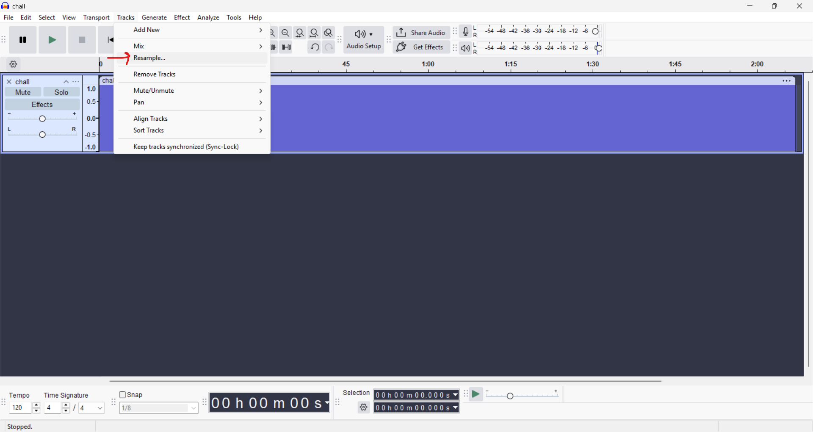
2. **File > Export audio**
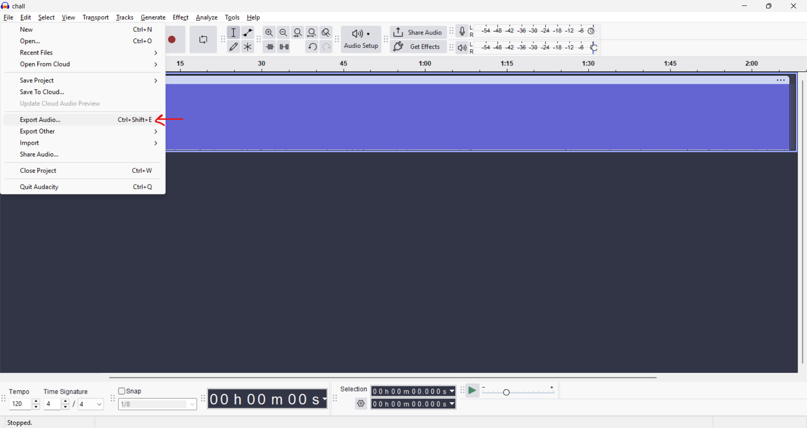
3. Match these settings and export. After the file saves, rename `chall.wav` to `chall.mmv`; only then can MMSSTV import and decode it. 
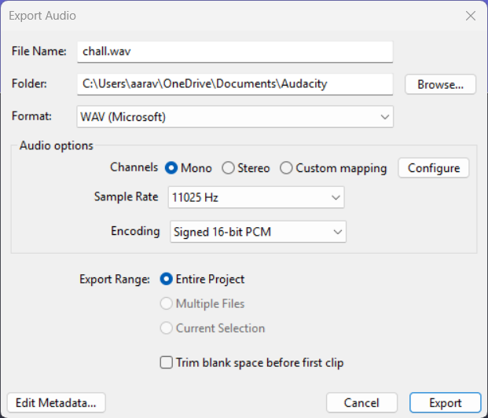
---

**File > Play sound from the file** -> select the .mmv file we just created and let it run
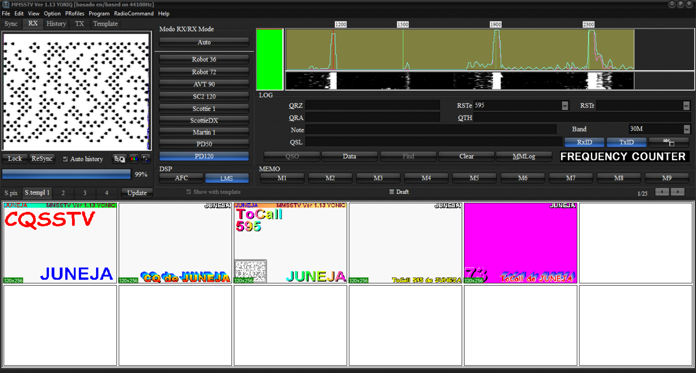

### DotCode Barcode

From MMSSTV we get this image:

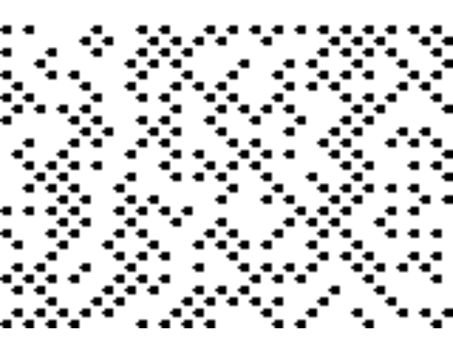

This is a DotCode 2D barcode:

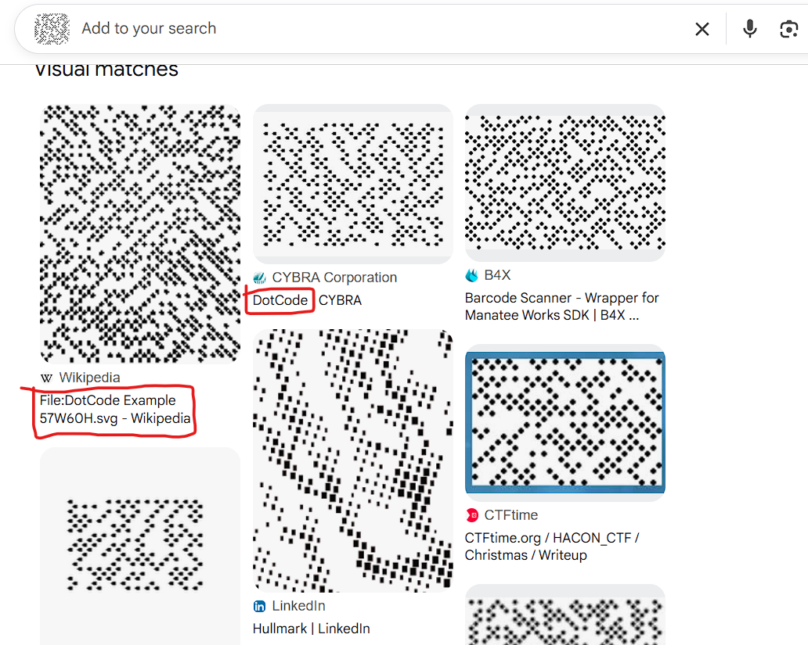

An online decoder such as https://products.aspose.app/barcode/recognize/dotcode can be used to read it.

`encryptid{h0ust0n_w3_h4ve_4_v1su4l}`