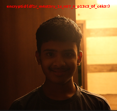

# Website Audit

## Description

> We noticed some odd traffic to our website from an internal host but I heard one of those assets wasn't what it claimed to be.

[network capture](chall.pcap)

## Solution

The easiest way to analyse such network captures is to use [Wireshark](https://www.wireshark.org/#download)

The pcap shows 13 different internal hosts (10.0.0.1-10.0.0.13) requesting various website assets, you may even refer to [network capture summary](summary.txt). Host `10.0.0.10` is the anomaly since it requests `/discarded_pfp.png` which does not sound like something that should be on production site and the server returns a ~61 KB response labeled as `image/png`.

1. Open `chall.pcap` in Wireshark.
2. Filter HTTP traffic: `http`.
3. Find packet 86 (the large 61015 byte response to `GET /discarded_pfp.png`).
4. Right-click -> **Follow** -> **HTTP Stream**.
5. The response body starts with `NINITEM\x00` instead of the PNG signature `\x89PNG\r\n\x1a\n`. This is a deliberately corrupted PNG header.
6. Save the raw response body: In the Follow HTTP Stream window, set **Show data as** to "Raw" and click **Save As** -> save as `corrupted.png`.
```bash
00000000: 4e49 4e49 5445 4d00 0000 000d 4948 4452  NINITEM.....IHDR
00000010: 0000 00e5 0000 00d8 0802 0000 009b 4fb3  ..............O.
00000020: 3200 00ed a549 4441 5478 9cbc fd69 d86d  2....IDATx...i.m
00000030: 6972 1506 ae15 efde e77c c39d 326f ce99  ir.......|..2o..
00000040: 35ab 060d a5aa 5249 4242 0819 1923 0989  5.....RIBB...#..
00000050: 064c d332 2001 0d74 0342 360f 4698 366e  .L.2 ..t.B6.F.6n
00000060: 30b4 0df8 a1e1 313c c6b2 1b03 0fb3 6506  0.....1<......e.
00000070: 0b24 84ec 1620 21a1 12a0 59a5 aa52 cd95  .$... !...Y..R..
00000080: 5999 5999 376f e69d bee1 9cb3 f71b ab7f  Y.Y.7o..........
00000090: 44c4 3e27 d5dd 3fe1 d355 d677 cf3d 679f  D.>'..?..U.w.=g.
```
7. Fix the header. The PNG magic bytes are 8 bytes long, so replace the first 8 bytes (`NINITEM\x00`) with the correct PNG signature (`\x89PNG\r\n\x1a\n`):
```python
data = bytearray(open('corrupted.png', 'rb').read())
data[:8] = b'\x89PNG\r\n\x1a\n'
open('flag.png', 'wb').write(data)
```
You can also use [HexEd.it](https://hexed.it/) for this task



`encryptid{df1r_m4st3ry_1s_n07_4_p13c3_0f_c4k3!}`
