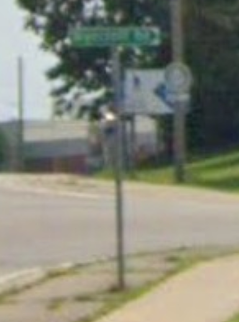

# OSINT

## Description

> Identify the exact location shown, enter the coordinates into the portal and you will receive the flag. Bring the flag back here and submit it to get your points.

`https://intech-osint.vercel.app`

## Solution

The first step in any geolocation challenge is establishing the general region. Looking around the scene, Canadian flags can be seen flying on the grassy hill narrowing the search space to Canada.

Examining the surroundings more closely we can see a multi lane divided road that curves to the left in the distance. On the right side is an elevated vehicle lot filled with pickup trucks which look like RAMs. While the pedestrian in the red shirt does not immediately provide any geographical clues they ultimately become important for pinpointing the exact location.

The most useful clue comes from the overhead highway gantry. The leftmost sign clearly reads: Third Line 3 km

Third Line is a major arterial road in Oakville, Ontario. Combined with the presence of High Occupancy Vehicle lanes and the style of the highway signage this strongly suggests that the highway in the background is the QEW (Queen Elizabeth Way) which passes directly through Oakville.

Knowing that Third Line is approximately 3 km away significantly narrows the search area along the QEW corridor. The next step was to match the road geometry visible in the image:
* A divided roadway curving left.
* A railway bridge crossing overhead.
* A RAM vehicle dealership located beside the road.
* Proximity to the QEW and Third Line.

Searching for RAM dealerships near the QEW in Oakville eventually leads to Oakville Chrysler Dodge Jeep RAM. Looking at Street View around the dealership and nearby railway bridge reveals a perfect match with the challenge image. The final confirmation comes from the pedestrian in the red shirt. Entering the coordinates (43.4509942, -79.6940503) of this location into the challenge portal returns the flag.

if u smart just read:

 Wyecroft Rd, Oakville, ON